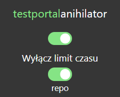

stan na 04.03.2021: nadal działa

# Testportal Anihilator
Wtyczka przeglądarkowa pozwalająca ominąć funckję 'uczciwy rozwiązujący' na TestPortalu, która uniemożliwia dezaktywację karty sprawdzianu podczas jego trwania. Pozwala także ominąć limit czasu na test. 

## Instalacja
* Pobierz ZIP rozwijając opcję 'Clone or download'
* Wejdź w opcje rozszerzeń swojej przeglądarki (ang. extensions)
* Zezwól na tryb developera i dodaj rozszerzenie z pobranego wcześniej ZIPa rozpakowując go wcześniej (wybierz folder bezpośrednio zawierający pliki rozszerzenia)

## Używanie
* Znajdź ikonę szpiega wśród aktywnych rozszerzeń

     

* Upewnij się że zaznaczono aktywację (zielony suwak)
* Gotowe! Podczas pomyślnego usunięcia blur-szpiega pojawi się na dole ekranu zielona wiadomość potwierdzająca

### Limit czasu
Aby włączyć funkcję omijania limitu czasu wystarczy kliknąć drugi suwak.
     

     
Dzięki temu, limit czasu na test zostaje wyłączony, a nauczyciel nie zostaje o tym powiadomiony.

## Aktualizacje
Gdy dostępna będzie nowsza wersja wtyczki niż ta, która jest zainstalowana u Ciebie w przeglądarce, pojawi się opcja "update available". By być pewnym działania wtyczki należy wtedy pobrać najnowszą wersje z repozytorium.

 
