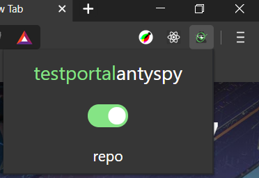
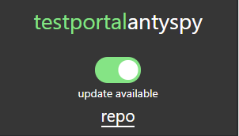

# stan na 02.10.2020: nadal działa

## WAŻNE! UPEWNIJ SIĘ ŻE WYBRAŁEŚ W LEWYM GÓRNYM ROGU branch INNY NIŻ MASTER, ZGODNY Z TWOJĄ PRZEGLĄDARKĄ

# Testportal Antyspy
Wtyczka przeglądarkowa pozwalająca oszukiwać podczas sprawdzianu internetowego. Proszę korzystać tylko w szlachetnych celach takich jak kalkulator czy ulobiony odtwarzacz muzyczny.

Aktualnie wspierane przeglądarki:
* chrome
* brave

## Instalacja
* Wybierz swoją przeglądarkę w zakładce 'branch'
* Pobierz ZIP rozwijając opcję 'Clone or download'
* Wejdź w opcje rozszerzeńswojej przeglądarki (ang. extensions)
* Zezwól na tryb developera i dodaj rozszerzenie z podbranego wcześniej ZIPa rozpakowując go wcześniej (wybierz folder bezpośrednio zawierający pliki rozszerzenia)

## Używanie
* Znajdź ikone szpiega wśród aktywnych rozszerzeń

* Upewnij się że zaznaczono aktywacje (zielony suwak)
* Gotowe! Podczas pomyślnego usunięcia blur-szpiega pojawi się na dole ekranu zielona wiadomość potwierdzająca

## Aktualizacje
Gdy dostępna będzie nowsza wersja wtyczki niż ta, która jest zainstalowana u Ciebie w przeglądarce, pojawi się opcja "update available". By być pewnym działania wtyczki należy wtedy pobrać najnowszą wersje z repozytorium. 

